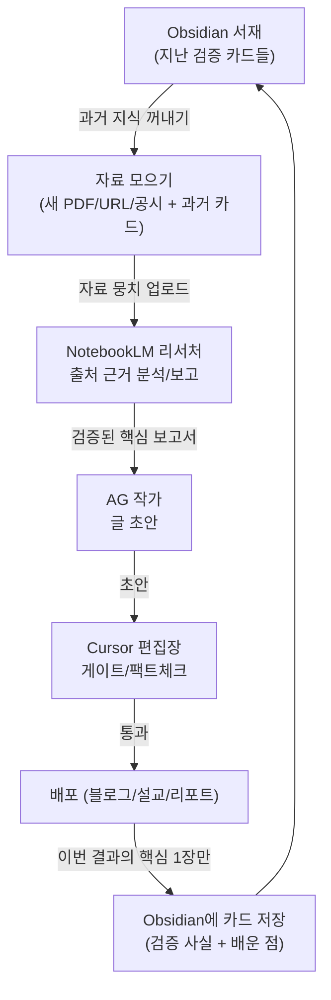

# GSF 콘텐츠 파이프라인 SOP — Obsidian + NotebookLM 워크플로 (2026-05-29)

> **용도:** 블로그/설교/투자 등 "자료 기반 산출물"을 만드는 표준 작업 흐름(SOP).
> **짧은 체크리스트(매번 보는 곳):** Obsidian `20 Areas/Playbooks/공통.md`
> **운영 SSOT(실행 규칙):** `~/.cursor/plans/gsf_mission_control_819a0f9b.plan.md`
> **비전 맥락:** [`GSF_LIFESTYLE_OS_VISION_20260528.md`](GSF_LIFESTYLE_OS_VISION_20260528.md) — 점→선→면, AG/Cursor 분담(§6)

---

## 0. 이 문서가 푸는 문제

> "자료는 쌓이는데, 나·AI의 역량 향상으로는 안 이어진다."

원인은 **축적(Capture)만 최적화되고 정제(Compress)·재노출(Recommend)·결과연결(Reflect)이 비어 있기 때문**이다.
증거: Obsidian Inbox에 raw 노트 80여 개, `status: curated`는 0개.

해결책은 **복리 루프(compounding loop)** 다. 작업이 끝날 때마다 *검증된 핵심 1장*만 영구 서재에 남기고, 다음 작업이 그만큼 유리한 출발점에서 시작하게 한다.

---

## 1. 출판사 비유 (역할 한눈에)

작업을 작은 출판사라고 생각하면, 각 도구가 직원이다.

- **Obsidian (GSF-PKM) = 서재 + 평생 노트.** 내가 소유하고 해마다 두꺼워지는 책장. 카드끼리 실로 연결. **영구 기억.**
- **NotebookLM = 전속 리서처(조사관).** 내가 건넨 자료만 읽고, "어느 출처 어디에 있다"며 출처를 짚어 보고. 일이 끝나면 책상을 치움. **임시 분석 책상.**
- **AG (Antigravity) = 작가.** 리서처 보고서를 매력적인 글로.
- **Cursor = 편집장/팩트체커.** 게이트 통과 도장.
- **배포 = 출판.**

> 한 줄: **Obsidian은 "오래 쌓는 곳", NotebookLM은 "지금 분석하는 곳". 하나는 기억, 하나는 이해.**

---

## 2. 역할 분담표

| 축 | Obsidian | NotebookLM |
|----|----------|------------|
| 성격 | 영구 창고 + 두뇌(연결) | 임시 분석 책상 |
| 넣는 것 | 증류된 핵심(재사용할 카드 1장) | 이번 주제 자료 뭉치(PDF·URL·공시 통째로) |
| 강점 | 누적·연결·소유·평생 검색 | 출처 근거 답변(할루시네이션 방지)·요약·오디오 브리핑 |
| 약점 | 자료 뭉치 "분석"은 약함 | 영구 기억 아님(노트북 단위) |
| 한 단어 | 기억 | 이해 |

**왜 NotebookLM이 신뢰성 문제에 답이 되나:** 내가 올린 자료 안에서만 답하고 항상 출처를 인용한다. "지어내기"가 구조적으로 어렵다 → 공시·논문·성경 주석처럼 틀리면 안 되는 자료 심문에 최적.

---

## 3. 흐름 — 고리를 닫는다



위쪽 Obsidian과 아래쪽 Save는 **같은 서재**다. 한 바퀴 돌 때마다 검증된 카드가 1장씩 늘고, 다음 글은 그만큼 유리한 출발점에서 시작한다. = 복리.

### 정제는 2단계다 (중요)

1. **NotebookLM** = 자료 → *출처 있는 분석* (무거운 일, AI가 함)
2. **사람/AG** = 그 분석 → *카드 1장* (어떤 인사이트가 중요한지 판단, 사람이 함)

NotebookLM이 카드를 자동으로 써주지 않는다. **믿을 수 있는 재료를 출처까지 붙여 차려주고, 최종 한 입(카드)은 내가 뜬다.** → 할루시네이션 방지 + 판단력 축적 동시 달성.

### 글쓰기는 한 번에 받지 말고 "대화로" (공통)

글쓰기(AG) 단계는 **에이전트와 묻고-답하기(Q&A)** 로 진행한다. 한 번에 완성 초안을 받기보다 작성 중 대화로 끌어내면 **톤이 더 "나답게", 내용이 풍부**해진다. (블로그·설교·투자 공통 — 2026-05-29 경험)

---

## 4. 결정 사항 (확정)

### 결정 A — 새 자료는 NotebookLM 직행

- 새 자료(PDF·URL·공시)는 **Obsidian Inbox를 거치지 않고 NotebookLM에 바로 업로드**한다.
- 이유: ① Inbox에 raw가 다시 쌓여 죽는 함정 차단 ② NotebookLM의 본업이 자료 분석 ③ 결과(카드)만 서재로 → 루프가 깔끔.
- **예외(보존):** 사라지면 안 되는 *원본*은 프로젝트 아카이브에 보관.
  - 블로그: `public/assets/sources/` (기존 정책)
  - 그 외: Obsidian `99 Attachments`
- **원칙:** 분석용 자료 = NotebookLM, 원본 보존 = 아카이브, **Inbox는 건너뛴다.**
- Inbox는 이제 "지금 처리 못 할 순간 메모"용으로만 작게 사용.

### 결정 B — NotebookLM 고정 3질문 + 유연 추가

매번 빠짐없이 묻는 **척추 질문 3개**:

1. **핵심 수치·사실은 무엇이고, 각각 어느 출처 어디에 있나?** (출처 인용 필수) → *사실 카드* 재료
2. **자료들 사이에 상충·반론·한계는 무엇인가?** → 글이 단단해지고 할루시네이션 방지
3. **한 줄 결론과, 독자(또는 투자 판단)에게의 의미는?** → *그래서 뭐(인사이트)* 재료

그 위에 **주제별 질문은 자유롭게 추가**(팔다리):
- 설교 → "이 본문의 감성 포인트와 적용은?"
- 투자 → "하방 리스크 시나리오와 트리거는?"
- 부동산 → "지역·시기별 비교는?"

> 멘탈 모델: 고정 3개 = 척추(일관성), 추가 질문 = 그날의 팔다리(유연성).

---

## 5. 카드 2종 — 무엇을 영구 보관하나

작업이 끝나면 raw가 아니라 **카드 1~2장**만 Obsidian에 남긴다. 카드는 두 종류이고 **수정 규칙이 다르다.**

### 5.1 사실 카드 (Fact) — `30 Resources/`

- 형식: **무엇**(검증 수치 + 출처 + 날짜) → **그래서 뭐**(인사이트 1줄)
- 예: `BOJ 정책금리 0.5% (2026-01, BOJ 발표) → 도쿄 임대수익률 압박`
- 1사실 1카드(원자적), 태그 `#fact`
- **수정 규칙 = 갱신(update) + 날짜.** 사실은 변한다(금리·환율·통계). 덮어쓰되 출처·날짜를 같이 남긴다.
- 시계열이 중요하면 트레일을 남긴다: `0.25%(2025-07) → 0.5%(2026-01)`

### 5.2 틀 카드 (Playbook) — `20 Areas/Playbooks/`

- 형식: "이 유형 글은 이렇게 구성하면 좋더라" (작법·구조 노하우)
- 예: `일본 macro 글은 Q&A 도입 > 시계열 도입 (가독성·검색 유입↑)`
- 폴더 분할: **블로그(영리) / 설교(비영리) / 투자(영리) / 공통**
  - 영리·비영리는 전략·톤 태그일 뿐, 분할의 진짜 이유는 *출력물 구조 DNA가 다르기 때문*.
  - 공통 = 셋 다 적용되는 작법(출처/각주 패턴, 할루시네이션 방지 질문법, 번역·PPT 변환 등) — 중복 방지.
- 태그 `#playbook`
- **수정 규칙 = 추가(append), 지우지 않는다.** 구조를 바꾼 경험은 "틀림"이 아니라 *배움이 늘어난 것*. 아래에 한 줄씩 쌓는다. 여정 자체가 자산.

### 5.3 카드 포맷을 바꿔도 되나?

된다. 카드는 **살아있는 노트(living note)** 지 박제가 아니다. 단,
1. 느슨하게 진화시킨다(필요할 때 칸 추가). 처음부터 완벽한 양식 X.
2. 과거 카드를 소급해 다 뜯어고치지 않는다(정리 강박 = 안티패턴). 앞으로 쓰는 카드만 새 포맷.
3. 포맷이 바뀌어도 **태그 하나(`#fact`/`#playbook`)는 일관**되게 → smart-connections·dataview가 자동으로 묶어줌.

---

## 6. Worked Example — 블로그 포스팅

주제: *"일본 금리 인상이 도쿄 부동산에 미치는 영향"*

1. **서재 열기 (Obsidian):** 기존 "BOJ 금리" 카드, "REINS 도쿄 맨션" 카드를 검색·소환. (처음엔 비어도 OK)
2. **자료 모으기:** BOJ 발표 PDF, REINS 통계, 뉴스 3건 + 위 과거 카드.
3. **분석 (NotebookLM):** 자료 업로드 → 고정 3질문 → 출처 박힌 보고서 (+ 원하면 오디오 브리핑으로 복습).
4. **글쓰기 (AG):** 보고서 기반 KO/EN/JA 초안.
5. **검증 (Cursor):** `SKIP_TRUST_VERIFY=1 pnpm validate:post <slug>` 게이트(fact-sheet·footnote·tone).
6. **배포:** 최종 머지/배포(사용자).
7. **카드 남기기:**
   - `30 Resources`에 **사실 카드**(검증 금리 수치 + 출처 + 날짜)
   - `20 Areas/Playbooks/블로그.md`에 **틀 카드** 한 줄(이번에 효과 본 구조)

다음에 Investor에서 "일본 매크로"를 보거나 다음 포스팅을 쓸 때 — **3번을 처음부터 다시 안 한다.** 서재에서 카드를 꺼내면 끝. (시너지 + 재사용 + 성장 동시 발생)

---

## 7. 다른 프로젝트로 복제 — 소스만 교체

이 흐름은 그대로 두고 NotebookLM에 넣는 자료와 Obsidian에 남기는 카드만 바꾼다.

| 프로젝트 | NotebookLM에 넣는 자료 | Obsidian에 남기는 카드 |
|----------|------------------------|------------------------|
| Blog (영리) | 일본 macro/부동산 자료 | 검증 지표 + 인사이트 |
| Sermon (비영리) | 성경 본문·주석·신학 자료 | 본문 해석 + 적용 포인트 |
| Investor (영리) | 공시·산업 리포트 | 검증 재무 사실 + 판단 근거 |
| Job | 수주 사례·AI 활용법 | 재사용 제안서/스킬 카드 |

> NotebookLM = 매번 자료만 갈아 끼우는 조사관, Obsidian = 모든 프로젝트가 공유하는 한 서재. = 점→선→면의 실제 배선.

---

## 8. 안티패턴 (하지 말 것)

- 자료를 Obsidian Inbox에 무작위로 쌓고 "나중에 정제" (= 무덤)
- raw 자료 통째로 Obsidian 보관 (카드 1장만)
- NotebookLM을 영구 보관처로 착각 (보관은 항상 Obsidian)
- 사실 카드를 날짜 없이 덮어쓰기 (시계열 추적 불가)
- 과거 카드 소급 재정리 강박

---

## 9. 도구별 활용 메모

- **NotebookLM:** 자료 업로드 → 출처 인용 Q&A, 요약, 오디오 브리핑(출퇴근 복습), 브리핑 문서. 노트북은 주제/프로젝트 단위로 분리.
- **Obsidian 플러그인 활용:**
  - `smart-connections` — 카드 간 의미 연결 자동 제안
  - `dataview` — `#fact`/`#playbook` 태그로 카드 목록 자동 집계
  - `templater` — 카드 템플릿 빠른 삽입
  - `read-it-later` — 순간 메모/링크 임시 저장(처리 후 카드로)

---

## 10. 위임 — AG에게 사실 카드 작성 맡기기

RACI: **AG = 탐색·리서치·초안 / 당신·Cursor = 검증·승인.**
루프: `[당신] 방향 → [AG] 소스+NotebookLM+카드 초안 → [당신/Cursor] verified 확인 → 승인`.

### AG가 읽어야 할 컨텍스트 (이 순서)

1. **이 문서** — 워크플로 전체(출판사 비유, 흐름, 결정 A/B, 카드 2종)
   - GitHub: https://github.com/asiaunion/mission-control/blob/main/docs/GSF_CONTENT_PIPELINE_SOP_20260529.md
2. `~/.cursor/plans/gsf_mission_control_819a0f9b.plan.md` — 운영 SSOT
3. Obsidian `20 Areas/Playbooks/공통.md` — 체크리스트 / `90 Templates/사실카드.md` — 카드 형식
4. 예시 완성 카드: Obsidian `30 Resources/BOJ 정책금리.md`

### 가드 2개 (반드시 지킴)

1. **`verified: true`는 출처에서 실제 확인됐을 때만.** AG는 초안을 `verified: false`로 제출하고 **근거(인용 구절/출처 페이지)**를 첨부한다. 당신이 확인 후 `true`로 승인.
2. **출처는 구체 URL** (홈페이지 `boj.or.jp/` 금지 → 발표문 PDF). 블로그 trust 규칙 `tier1-url-specificity`와 동일.

### 위임 지시문 (AG에 그대로 붙여넣기)

```
[사실 카드 작성 위임 — GSF 콘텐츠 파이프라인 SOP 기준]
먼저 다음을 읽어 컨텍스트를 확보해:
- mission-control/docs/GSF_CONTENT_PIPELINE_SOP_20260529.md (또는 GitHub 정본)
  https://github.com/asiaunion/mission-control/blob/main/docs/GSF_CONTENT_PIPELINE_SOP_20260529.md
- Obsidian 20 Areas/Playbooks/공통.md, 90 Templates/사실카드.md
- 예시: Obsidian 30 Resources/BOJ 정책금리.md

주제: (예: JPYKRW 환율 / REINS 도쿄 맨션 …)
1. tier-1 원본 소스를 찾아 NotebookLM에 넣고 고정 3질문으로 분석.
2. Obsidian 30 Resources/<주제>.md 를 사실카드 형식으로 작성:
   무엇(값 + 구체 출처 URL + 날짜 + 트레일) → 그래서 뭐(인사이트) → 재사용처.
3. verified는 false로 두고, 검증 근거(출처 구절/인용)를 함께 제시.
   내가 확인 후 true로 승인한다.
규칙: 홈페이지 URL 금지(구체 페이지/PDF), 사실은 갱신+날짜, 태그 #fact.
```

---

*작성: 2026-05-29 · 짧은 SOP: Obsidian `20 Areas/Playbooks/공통.md` · GitHub: https://github.com/asiaunion/mission-control/blob/main/docs/GSF_CONTENT_PIPELINE_SOP_20260529.md*
