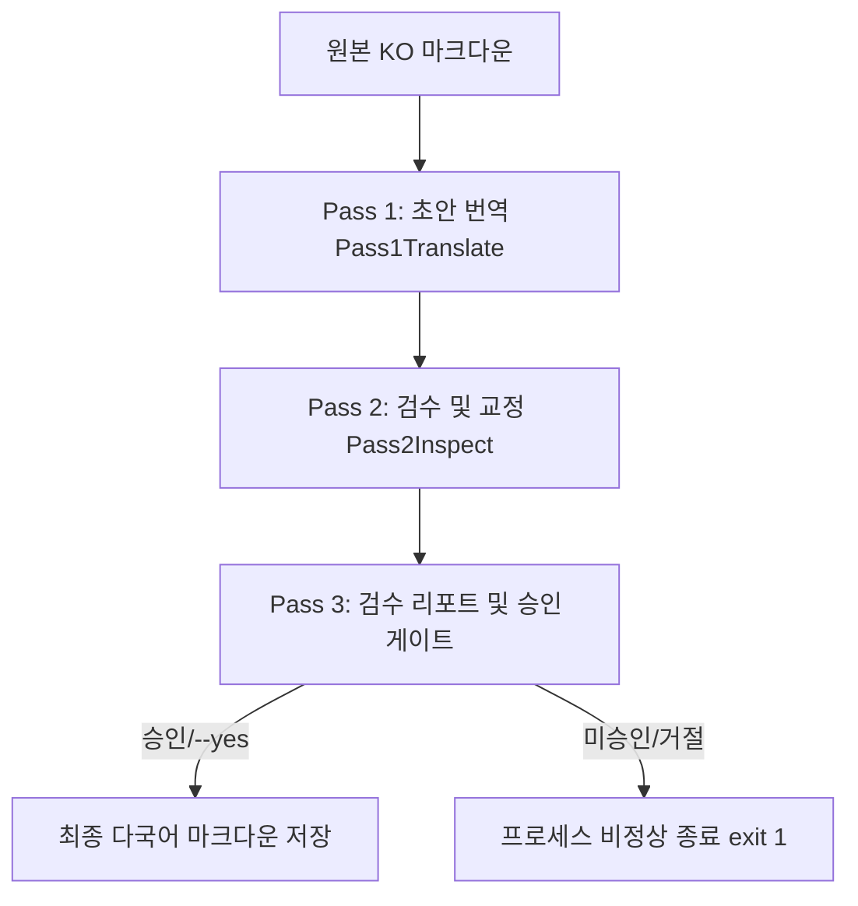

# GSF-Blog 3-Pass 번역 CLI 도구

이 도구는 블로그 포스트 마크다운 파일(KO)을 다국어(EN, JA)로 높은 일관성과 전문성을 유지하며 번역하기 위해 구축된 **Zero-Dependency 3-Pass 번역 오케스트레이터**입니다.

## 🛠 작동 구조 (3-Pass Pipeline)

번역은 총 3단계(Pass) 파이프라인을 거쳐 진행됩니다:



1. **Pass 1: 초안 번역 (Pass 1 Translation)**
   - 지정된 페르소나 및 다국어 규칙(`scripts/translate/persona/`)을 프롬프트 주입하여, 원본 마크다운 구조(프론트매터 및 바디)를 일차적으로 번역합니다.
2. **Pass 2: 검수 및 교정 (Inspector & Refiner)**
   - 1차 초안과 원본 본문을 교차 비교합니다.
   - 번역 중 유실되거나 훼손된 마크다운 태그(HTML 인라인 SVG 차트, 앵커, Strong 등)를 완벽하게 복원 및 대조하여 초안을 정밀 정제합니다.
   - 프론트매터의 키 명칭 보존 및 값의 철저한 현지화 여부를 추가 검증합니다.
3. **Pass 3: 검수 리포트 및 HITL(Human-In-The-Loop) 승인 게이트**
   - 변경점을 한눈에 파악할 수 있는 ANSI 컬러 터미널 Diff 리포트와 주요 프론트매터(Title, Description 등) 비교 보고서를 제공합니다.
   - 인터랙티브 프롬프트를 통해 최종 승인을 획득한 후 목적 경로(`src/data/blog/<lang>/`)에 안전하게 저장합니다.
   - `--yes` 플래그 사용 시 승인 단계를 스킵하고 즉시 저장합니다.
   - 승인 거절 시 프로세스는 `exit 1`로 명확하게 종료되어 CI/CD 파이프라인 연동 시 빌드 실패 처리를 지원합니다.

## 📋 환경 요구사항

- **Node.js**: v18 이상 권장
- **Ollama**: 로컬 또는 원격에서 실행 중인 Ollama 인스턴스 (디폴트: `http://localhost:11434`)
- **LLM 모델**: 번역을 수행할 수 있는 Ollama 로드 완료 모델 (예: `gemma2`, `gemma2:9b`, `qwen2.5:1.5b` 등)

## 🚀 사용법 및 명령어 예제

### 기본 실행 (인터랙티브 승인 게이트 활성화)

```bash
node scripts/translate/translate.mjs <source_file_path> <target_lang> [model_name]
```

* **source_file_path**: 원본 마크다운 파일의 경로 (예: `src/data/blog/ko/my-post.md`)
* **target_lang**: 타겟 언어 (`en` 또는 `ja` 중 하나)
* **model_name**: (옵션) 사용할 Ollama 모델명. 지정하지 않을 시 기본값은 `gemma2:9b`입니다.

**예제 (일본어 번역 및 gemma2:9b 모델 사용):**
```bash
node scripts/translate/translate.mjs src/data/blog/ko/macro-barrier-and-super-scarce-real-estate-selection.md ja gemma2:9b
```

---

### 자동 저장 실행 (`--yes` 플래그)

승인 절차를 생략하고 번역 결과를 즉시 목적 디렉토리에 저장하고 싶을 때 사용합니다. CI/CD 환경이나 자동화 스크립트 실행 시 필수적입니다.

```bash
node scripts/translate/translate.mjs <source_file_path> <target_lang> [model_name] --yes
```

**예제:**
```bash
node scripts/translate/translate.mjs src/data/blog/ko/macro-barrier-and-super-scarce-real-estate-selection.md en gemma2:9b --yes
```

---

### 차트 에셋

**전체 가이드:** [`docs/CHARTS_AND_VISUALS.md`](../../docs/CHARTS_AND_VISUALS.md)

- 데이터 차트: CSV → `scripts/charts/generate-*.py` → **WebP** → MDX `<figure class="supplemental-chart">`
- 인라인 `<svg>` / `MacroBarrierChart`류 Astro 차트 / AI 생성 차트 이미지 **금지**
- 번역 시 `figure`/`figcaption`/`alt`만 현지화; 수치 변경 시 CSV 재생성 후 WebP 커밋

---

### Ollama 모델 경로 (`ollama list`가 비어 있을 때)

macOS Ollama 앱은 기본적으로 `~/.ollama/models`를 봅니다. 모델을 외장 경로(예: `/Volumes/D/AI/ollama/models`)에 두었다면 다음 중 하나를 적용하세요.

```bash
# 권장: 홈 경로를 실제 라이브러리로 심볼릭 링크
mv ~/.ollama/models ~/.ollama/models.empty-backup   # 기존 빈 폴더 백업
ln -s /Volumes/D/AI/ollama/models ~/.ollama/models
# Ollama 앱 완전 종료 후 재실행 → ollama list 에 모델 표시 확인
```

또는 앱 재시작 전에 `export OLLAMA_MODELS=/Volumes/D/AI/ollama/models` (LaunchAgent/셸 프로필에 영구 설정).

---

### 승인 거부 시 동작 (CI/CD 대응)

인터랙티브 승인 대기 상태에서 `n` 또는 `no`를 입력하면 번역 저장을 취소하며, **exit code `1`**을 반환하며 비정상 종료합니다. 이는 스크립트 빌드 파이프라인에서 오류를 감지하여 원치 않는 데이터 유실이나 미완성 파일의 배포를 자동 차단하는 역할을 합니다.
